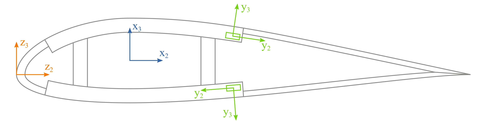
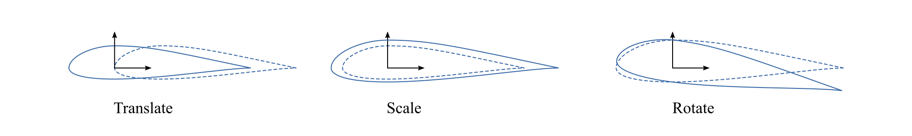

(coordinate-systems)=
# Coordinate systems

There are three coordinate frames used in PreVABS:

- **z** is a basic frame, for the normalized airfoil data points for instance;
- **x** is the final frame;
- **y** is the local frame for each element.

Here, $x_1$, $y_1$, and $z_1$, are parallel to the tangent of the beam reference line and pointing out of the paper.
The basic frame is where base points are defined.
The cross-sectional and elementary frames have the same definitions as those in VABS.
User can define the topology of a cross section in the basic frame **z** and use manipulations like translation, scaling and rotation to generate the actual geometry in **x**.
For an airfoil cross section, airfoil surface data points downloaded from a database having chord length 1 are in the frame **z**, and they are transformed into the frame **x** through translation (re-define the origin), scaling (multiplied by the actual chord length), and rotation (attack angle) if necessary:

More details about this transformation can be found in [this section](#other-input-settings).

In PreVABS, the definition of the elementary frame **y** follows the rule that the positive direction of $y_2$ axis is always the same as the direction of the base line, and then $y_3$ is generated based on $y_1$ and $y_2$ according to the right-hand rule.
More details about the base line can be found in [this section](#geometry-and-shapes).
