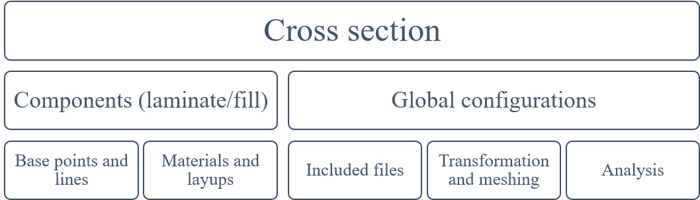

(section-prevabs_guide)=
# Input Guide

In PreVABS, a cross section is defined through two aspects: components and global configuration:


Components are built from geometry and materials.
The geometry aspect comprises definitions of base points and base lines.
The material aspect includes material properties, lamina thicknesses, layup stacking sequences, etc.
The global configuration contains the files included, transformation, meshing options, and analysis settings.


A complete cross-section model can be defined entirely inside a single top-level XML file.
Geometry, material and layup definitions can also be stored in separate XML files (or, for airfoil and large point lists, plain `.dat` files) and referenced from the main file via an `<include>` block.

The top-level XML element is `<cross_section>` (the legacy alias `<sg>` is also accepted).
The input syntax is:

```xml
<cross_section name="" format="">
  <include>...</include>
  <analysis>...</analysis>
  <general>...</general>
  <baselines>...</baselines>
  <materials>...</materials>
  <layups>...</layups>
  <component>...</component>
  <component>...</component>
  ...
  <global>...</global>
</cross_section>
```

The `format` attribute is retained for backward compatibility.
In the current version each top-level block (`<baselines>`, `<materials>`, `<layups>`) can be either embedded directly in the main file or referenced through `<include>` independently — the value of `format` no longer controls the location exclusively.

**Specification**

- `<cross_section>` (or `<sg>`)
  - `name` - Name of the cross-section. Required.
  - `format` - Format of the input file (legacy attribute). Optional.

- `<include>` - File names of separately stored data (baselines, materials, layups).
- `<analysis>` - Configurations of cross-sectional analysis.
- `<general>` - Overall settings of the cross-section. Required.
- `<baselines>` - Definitions of geometry (points and lines).
- `<materials>` - Definitions of materials and laminae (when defined inline).
- `<layups>` - Definitions of layups.
- `<component>` - Definitions of cross-sectional components. At least one is required.
- `<global>` - Global beam analysis results used for recovery / failure analysis.


```{toctree}
:maxdepth: 2
:caption: Subtopics

pre_coordinate.md
pre_shape.md
pre_material.md
pre_component.md
pre_recover.md
pre_overall.md
```

