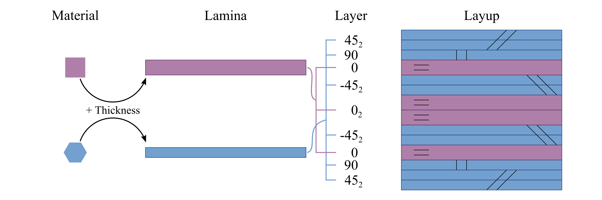
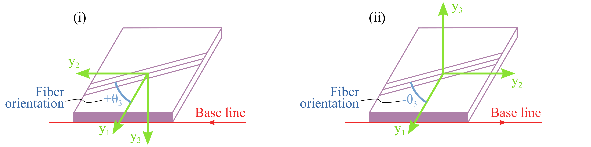

(input-layup)=
# Layup

A layer is a stack of laminae with the same fiber orientation.
The thickness of a layer can only be a multiplier of the lamina thickness.
Layup is several layers stacked together in a specific order.
This relationship is illustrated as:



In general, there are two ways to define a layup, explicit list and stacking sequence code.
For the explicit list, a laminate is laid onto the base line from the first layer in the list to the last one, in the direction given by the user.
For the stacking sequence, the layup starts from left to the right.
User should pay attention to the relations among the base line direction, elemental frame **y** and fiber orientation $\theta_3$ of each layer:


Change of direction of the base line will change the elemental frame **y** as defined, which will further require the user to change the fiber orientations accordingly, even though nothing changes physically.
All layup information are included in one XML file.
A template of this file is:

```xml
<layups>
  <layup name="layup1" method="explicit list">
    <layer lamina="lamina1">...</layer>
    ...
  </layup>
  <layup name="layup2" method="stack sequence">...</layup>
  <layup name="layup3" method="ply percentage">...</layup>
  ...
</layups>
```


**Specification**

- `<layup>` - Root element for the definition of each layup.

  - `name` - Name of the layup.
  - `method` - Method of defining the layup. Choose one from 'layer list' (or 'll') and 'stack sequence' (or 'ss'). Default is 'layer list'.


```{toctree}
:maxdepth: 2
:caption: Subtopics

layup-layerlist
layup-stackseq
```


An example for the [layup](#fig-layup) is:

```xml
<materials>
  <material name="square" type="orthotropic">
    <density>...</density>
    <elastic>...</elastic>
  </material>

  <material name="hexagon" type="orthotropic">
    <density>...</density>
    <elastic>...</elastic>
  </material>

  <lamina name="la_square_15">
    <material> square </material>
    <thickness> 1.5 </thickness>
  </lamina>

  <lamina name="la_hexagon_10">
    <material> hexagon </material>
    <thickness> 1.0 </thickness>
  </lamina>
</materials>
```

```xml
<layups>
    <layup name="layup_el" method="explicit list">
        <layer lamina="la_hexagon_10"> 45:2 </layer>
        <layer lamina="la_hexagon_10"> 90 </layer>
        <layer lamina="la_square_15"></layer>
        <layer lamina="la_hexagon_10"> -45:2 </layer>
        <layer lamina="la_square_15"> 0:2 </layer>
        <layer lamina="la_hexagon_10"> -45:2 </layer>
        <layer lamina="la_square_15"></layer>
        <layer lamina="la_hexagon_10"> 90 </layer>
        <layer lamina="la_hexagon_10"> 45:2 </layer>
    </layup>

    <layup name="layup_ss" method="stack sequence">
        <lamina> la_square_15 </lamina>
        <code> [(45/-45):2/0:4/90]2s </code>
    </layup>
</layups>
```

