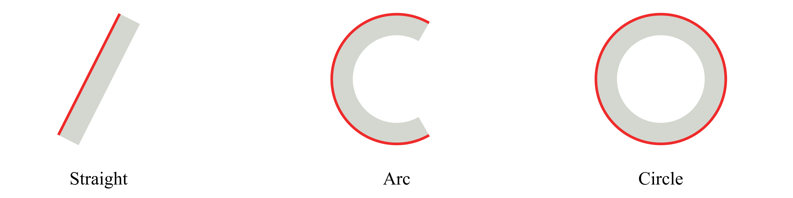
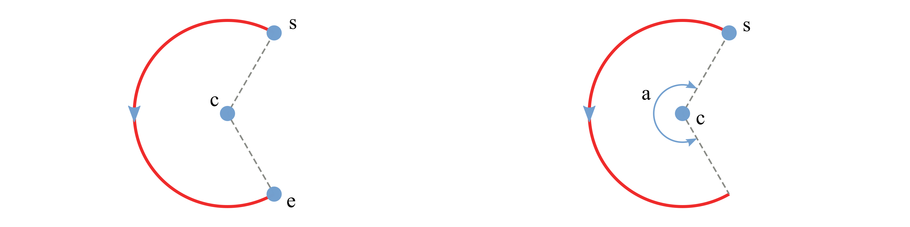

(geometry-and-shapes)=
# Geometry and shapes

The overall geometry and shape of a cross-section is defined by a series of base lines, forming the skeleton of it.
The basic geometric elements are points and lines.
The overall arrangement of the data is:
```xml
<baselines>
  <point name="p1">...<point>
  <point name="p2">...<point>
  ...
  <baseline name="name1" type="straight">...</baseline>
  <baseline name="name2" type="arc">...</baseline>
  <baseline name="name3" type="circle">...</baseline>
  ...
</baselines>
```
The root element is `<baselines>`.
It can contain arbitrary number of `<point>` and `<baseline>` elements.


## Base points

Base points are used to draw base lines, which form the skeleton of a cross section.
They can be either actually on the base lines, or not, as reference points, for example the center of a circle.
Points that are directly referred to in the definitions of base lines are called key points, such as starting and ending points of a line or an arc, or the center of a circle.
The rest are normal points.
The coordinates provided in the input file are defined in the basic frame **z** and then transformed into the cross-sectional frame **x**, through processes like translating, scaling and rotating.
If none of those operations are needed, then those data also define the position of each point in the frame **x**.

Users can define points using sub-element `<point>` one-by-one, or list all points in a sepsrate file and include it here.

### Points defined in the main XML file

Using the XML format, points can be defined in the following ways:

1. Specify the complete coordinates with two numbers separated by spaces.
2. Confine the point on a line and specify the horizontal coordinate ($z_2$ or $x_2$):

   `<point name="M" on="L" by="x2">3</point>`


**Specification**

- `<include>`: Name of the point data file, without the file extension.
- `<point>`: Coordinates of the point. For the first method, two numbers are needed and seperated by blanks. For the second method, only one number is needed.
  - Attributes
    - `name`: Name of the point. Required.
    - `on`: Name of the line confining the point. Optional.
    - `by`: Axis along which the coordinate is specified. Required if the point is defined on a line. Currently `x2` is the only option.


### Points defined in a data file

The file storing these data is a plain text file, with a file extension `.dat`.
This block of data has three columns for the name and coordinate in the cross-sectional plane.

```
label_1  z2  z3
label_2  z2  z3
label_3  z2  z3
...
```

To include the point data file in the main xml input:
```xml
<basepoints>
  <include> point_list_file_name </include>
</basepoints>
```

**Specification**

- Three columns are separated by spaces.
- `label` can be the combination of any letters, numbers and underscores "_".

> [!NOTE]
> Normal points' names can be less meaningful, even identical.


> [!NOTE]
> If a base line is defined using the range method (explained below), e.g. 'a:b', then all points from 'a' to 'b' will be used.
> In this case, the order of points is important.
> Otherwise, points can be arranged arbitrarily.

> [!NOTE]
> This data file can be used for storing airfoil data.


## Base lines


PreVABS can handle three types of base lines, straight, arc and circle:


Some types have several ways to define the base line.
In PreVABS, all curved base lines are in the end converted into a polyline.
User can define polylines directly for spline, arc and circle.
Or, for arc or circle, user can use simple rules to draw the shape first and then PreVABS will discretize it.


Each `<baseline>` element is a definition of a base line.
Each one has a unique `name` and a `type`, which can be `straight`, `arc` or `circle`.
Inside the `baseline` element, the `straight` and `arc` types have several different ways of definition, and thus the arrangements of data are different, which will be explained in details below.


**Specification**

- `<baseline>`: Definition of a base line (explained below).
  - Attributes
    - `name`: Name of the base line. Required.
    - `type`: Type of the base line. Required. Choose one from 'straight', 'arc' and 'circle'.


### Straight

For this type, the basic idea is to provide key points for a chain of straight lines.
The direction of a base line is defined by the order of the point list.
There are three ways defining a base line of this type:


1. Use a comma-separated list of two or more points to define a polyline (i, ii).

```xml
<baselines>
    ...
    <baseline name="i" type="straight">
      <points> a,z </points>  <!-- Line defined by points a and z -->
    </baseline>
    
    <baseline name="ii" type="straight">
      <points> a,b,c,z </points>  <!-- Line defined by points a, b, c, and z -->
    </baseline>
    
    <baseline name="closed" type="straight">
      <points> a,b,c,z,a </points>  <!-- Closed polyline defined by points a, b, c, z, and a -->
    </baseline>
    ...
</baselines>
```

2. Use two points separated by a colon to represent a range of points (iii). The first two methods can be used in combination.
```xml
<baselines>
    ...
    <baseline name="iii" type="straight">
      <points> a:z </points>  <!-- Line defined by points from a to z -->
    </baseline>

    <baseline name="iii-2" type="straight">
      <points> a:z,b,c </points>  <!-- Line defined by points from a to z and b and c -->
    </baseline>
    ...
</baselines>
```

3. Use a point and a incline angle to define an straight line (iv).
   In this case, PreVABS will calculate the second key point (a') and generate the base line.
   The PreVABS-computed second key point will always be "not lower" than the user-provided key point, which means the base line will always be pointing to the upper left or upper right, or to the right if it is horizontal.

```xml
<baselines>
    ...
    <baseline name="iv" type="straight">
      <point> a </point>  <!-- Line defined by the point a and an angle theta -->
      <angle> theta </angle>
    </baseline>
    ...
</baselines>
```

> [!NOTE]
> Use `type="straight"` for splines.


Example inputs of the lines above:

**Specification**

- `<points>`: Names of points defining the base line, separated by commas (explicit list), or colons (range). Blanks are not allowed between points names.
- `<point>`: Name of a point.
- `<angle>`: Incline angle of the line. The positive angle (degree) is defined from the positive z₂ axis, counter-clockwise.


### Arc

A real arc can also be created using a group of base points, in which case the straight type should be used.
The arc type provides a parametric way to build this type of base line, then PreVABS will
discretize it.
To uniquely define an arc, user needs to provide at least four of the following six items: center, starting point, ending point, radius, angle and direction:


There are two ways of defining an arc:


- Use center, starting point, ending point and direction.
- Use center, starting point, angle and direction.

Example inputs:

```xml
<baselines>
    ...
    <baseline name="left" type="arc">
        <center> c </center>
        <start> s </start>
        <end> e </end>
        <direction> ccw </direction>
        <discrete by="angle"> 9 </discrete>
    </baseline>

    <baseline name="right" type="arc">
        <center> c </center>
        <start> s </start>
        <angle> a </angle>
        <discrete by="number"> 10 </discrete>
    </baseline>
    ...
</baselines>
```

**Specification**

- `<center>`: Name of the center point.
- `<start>`: Name of the starting point.
- `<end>`: Name of the ending point.
- `<direction>`: Direction of the circular arc. Choose from 'cw' (clockwise) and 'ccw' (counter-clockwise). Default is 'ccw'.
- `<angle>`: Central angle of the arc.
- `<discrete>`: Number of discretization. If 'by="angle"', then new points are created every specified degrees of angle. If 'by="number"', then specified number of new points are created and evenly distributed on the arc.
  - Attributes
    - `by`: Choose one from 'angle' and 'number'. Default is 'angle'.


### Circle

Defining a circle is simpler than an arc.
User only need to provide a center with radius or another point on the circle.
The corresponding element tags are `<center>`, `<radius>` and `<point>`.

There are two ways of defining a circle:

- Use center and radius.
- Use center and a point on the circle.

A sample input file demonstrating the two methods:

```xml
<baselines>
    ...
    <baseline name="circle1" type="circle">
        <center> c </center>
        <radius> r </radius>
    </baseline>

    <baseline name="circle2" type="circle">
        <center> c </center>
        <point> p </point>
        <direction> cw </direction>
    </baseline>
    ...
</baselines>
```

**Specification**

- `<center>`: Name of the center point.
- `<radius>`: Radius of the circle.
- `<point>`: Name of a point on the circle.
- `<direction>`: Direction of the circle. Choose from 'cw' (clockwise) and 'ccw' (counter-clockwise). Default is 'ccw'.
- `<discrete>`: Number of discretization. If 'by="angle"', then new points are created every specified degrees of angle. If 'by="number"', then specified number of new points are created and evenly distributed on the circle.
  - Attributes
    - `by`: Choose one from 'angle' and 'number'. Default is 'angle'.


