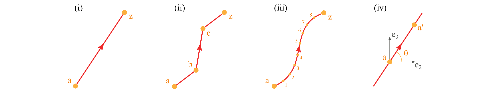

(input-shape-line-polyline)=
# Straight

For this type, the basic idea is to provide key points for a chain of straight lines.
The direction of a base line is defined by the order of the point list.
There are three ways defining a base line of this type:


1. Use a comma-separated list of two or more points to define a polyline (i, ii).

```xml
<baselines>
    ...
    <line name="i" type="straight">
      <points> a,z </points>  <!-- Line defined by points a and z -->
    </line>

    <line name="ii" type="straight">
      <points> a,b,c,z </points>  <!-- Line defined by points a, b, c, and z -->
    </line>

    <line name="closed" type="straight">
      <points> a,b,c,z,a </points>  <!-- Closed polyline defined by points a, b, c, z, and a -->
    </line>
    ...
</baselines>
```

2. Use two points separated by a colon to represent a range of points (iii). The first two methods can be used in combination.
```xml
<baselines>
    ...
    <line name="iii" type="straight">
      <points> a:z </points>  <!-- Line defined by points from a to z -->
    </line>

    <line name="iii-2" type="straight">
      <points> a:z,b,c </points>  <!-- Line defined by points from a to z and b and c -->
    </line>
    ...
</baselines>
```

3. Use a point and an incline angle to define a straight line (iv).
   In this case, PreVABS will calculate the second key point (a') and generate the base line.
   The PreVABS-computed second key point will always be "not lower" than the user-provided key point, which means the base line will always be pointing to the upper left or upper right, or to the right if it is horizontal.

```xml
<baselines>
    ...
    <line name="iv" type="straight">
      <point> a </point>  <!-- Line defined by the point a and an angle theta -->
      <angle> theta </angle>
    </line>
    ...
</baselines>
```

```{note} Note
Use `type="straight"` for splines.
```

**Specification**

- `<points>`: Names of points defining the base line, separated by commas (explicit list), or colons (range). Blanks are not allowed between points names.
- `<point>`: Name of a point.
- `<angle>`: Incline angle of the line. The positive angle (degree) is defined from the positive z₂ axis, counter-clockwise.

The `<point>`+`<angle>` form accepts an optional `loc` attribute on the `<point>` to control whether the user-provided point is the line's midpoint (`loc="inner"`, default) or its starting endpoint (`loc="end"`).

