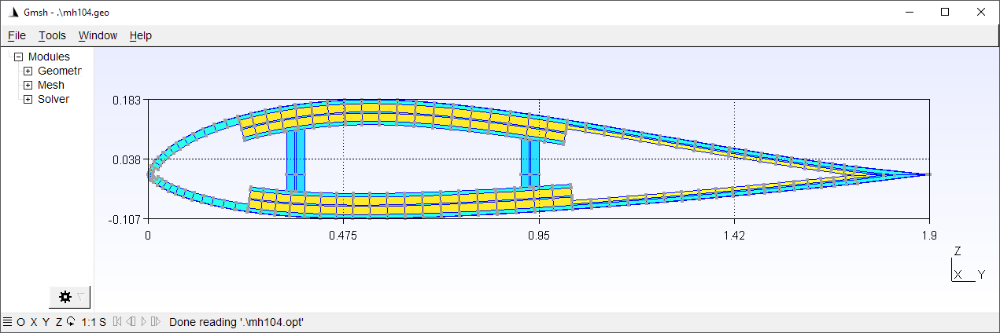
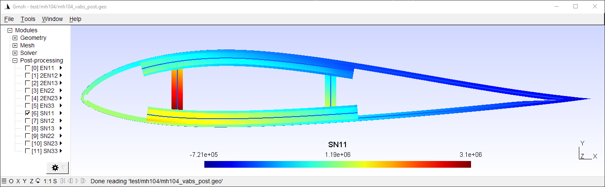

# How to Run PreVABS

PreVABS is a command line based program which acts as a general-purpose preprocessor and postprocessor based on parametric inputs necessary for designing a cross section.

Download the examples package from [cdmHUB](https://cdmhub.org/resources/1597/supportingdocs), and unpack it to any location.

## Quick start

If you have already added the folder where you stored VABS, Gmsh and PreVABS to the system or user environment variable `PATH`, to execute PreVABS, you can open any command line tool (Command Prompt or PowerShell on Windows, Terminal on Linux), change directory to the root of the PreVABS package, and type the following command:

### On Windows:

```bash
prevabs -i examples\ex_airfoil\mh104.xml -h -v
```

### On Linux:

```bash
prevabs -i examples/ex_airfoil/mh104.xml -h -v
```

The first option `-i` indicates the path and name for the cross section file (`ex_airfoil\mh104.xml` for this case).
The second option `-h` indicates the analysis to compute cross-sectional properties (this analysis is also called homogenization), where meshed cross section will be built and VABS input file will be generated.
The last option `-v` is for visualizing the meshed cross section.

PreVABS will read the parametric input files and generate the meshed cross section.

Once finished, PreVABS will invoke Gmsh, a tool for visualization, to show the cross section with the corresponding meshes



Three files are generated in the same location at this moment, a VABS input file `mh104.sg`, a Gmsh geometry file `mh104.geo`, a Gmsh mesh file `mh104.msh`, and a Gmsh option file `mh104.opt`.
The geometry file is used to inspect errors when meshing cannot be accomplished.
The latter three files are generated only when visualization is needed.

Then user can run VABS using the generated input file.

> [!NOTE]
> PreVABS and Gmsh are free and open source.
> The source codes of PreVABS is available [here](https://cdmhub.org/resources/1597).
> You can make changes to the code.
> However, VABS is a commercial code and you need to request the code and a valid license from [AnalySwift](http://analyswift.com/).


## Command line options

PreVABS is executed using command `prevabs` with other options.
If no option is given, a list of available arguments will be printed on the screen.

```bash
prevabs -i <main_input_file_name.xml> [options]
```

| Option  | Description |
|---------|-------------|
| -h      | Build the cross-section for homogenization |
| -d      | Read 1D beam analysis results and update VABS/SwiftComp input file for dehomogenization |
| -fi     | Initial failure indices and strength ratios |
| -f      | Initial failure strength analysis (SwiftComp only) |
| -fe     | Initial failure envelope (SwiftComp only) |
| -vabs   | Use VABS format (Default) |
| -sc     | Use SwiftComp format |
| -int    | Run integrated solver (VABS only) |
| -e      | Run standalone solver |
| -v      | Visualize meshed cross section for homogenization or contour plots of stresses and strains after recovery |
| -debug  | Debug mode |


## Running cases

Some possible use cases are given below.

### Case 1: Build cross section from parametric input files

```bash
prevabs -i <cross_section_file_name.xml> -h -v
```

In this case, parametric input files are prepared for the first time, and one may want to check the correctness of these files and whether the cross section can be built as designed.
One may also want to try different meshing sizes before running the analysis.

### Case 2: Carry out homogenization without visualization

```bash
prevabs -i <cross_section_file_name.xml> -h -e
```

The command will build the cross section model, generate the input, and run VABS to calculate the cross-sectional properties, without seeing the plot, since visualization needs extra computing time and resources.
One can also make modifications to the design (change the parametric inputs) and do this step repeatedly.
If you already have generated the input file `cross_section_vabs.dat`, and want to only run VABS, you can invoke VABS directly using `VABS cross_section_vabs.dat`.

Since PreVABS 1.4 and VABS version 4.0, a dynamic link library of VABS is provided.
Users can run the cross-sectional analysis using the library instead of the standalone executable file.
This will remove the time cost by writing and reading the VABS input file, and reducing the total running time.
The command is:

```bash
prevabs -i <cross_section_file_name.xml> -h -vabs -int
```

### Case 3: Recover 3D stress/strain and plot

```bash
prevabs -i <cross_section_file_name.xml> -d -e -v
```

After getting the results from a 1D beam analysis, one may want to find the local strains and stresses of a cross section at some location along the beam.
This command will let PreVABS read those results, update the VABS input file, carry out recovery analysis, and finally draw contour plots in Gmsh



An example of the recover analysis can be found [here](#airfoil-(recover)).

> [!NOTE]
> Before any recovery run, a homogenization (with option `-h`) run must be carried out first for a cross section file.
> In other words, the file `cross_section.dat.opt` must be generated before the recovery run.
> Besides, results from the 1D beam analysis need to be added into the `cross_section.xml` file.
> Preparation of this part of data is explained in Section: {ref}`section-recover`.


Plotted data are the nodal strains and stresses in the global coordinate system.

